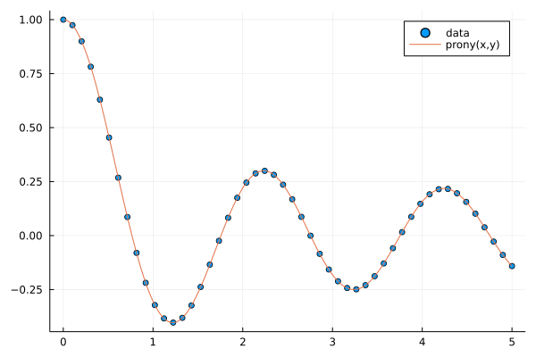
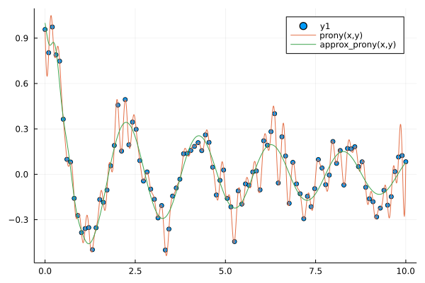

# Prony.jl
Julia package for oscillating exponential fitting.

[](https://github.com/IlianPihlajamaa/Prony.jl/actions)
[](http://codecov.io/github/IlianPihlajamaa/Prony.jl?branch=main)

This is a pure julia implementation of Prony's method. See for example:

Fernández Rodríguez, A., de Santiago Rodrigo, L., López Guillén, E. et al. Coding Prony’s method in MATLAB and applying it to biomedical signal filtering. BMC Bioinformatics 19, 451 (2018). https://doi.org/10.1186/s12859-018-2473-y

https://en.wikipedia.org/wiki/Prony%27s_method

The package exports an implementation of the standard Prony interpolation `prony(x, y)`. Additionally it provides a simple approximate Prony's method `prony(x, y, N)` that is better suited to noisy data. Here `x` is an equidistant sample grid, `y` is the sampled data, and `N` is the number of oscillating exponentials that are used to approximate `y`. The approximate method `prony(x, y, N)` keeps only the `N` exponentials with largest weight in the expansion.

It tries to find exponential amplitudes `A_j` and bases `B_j`, such that


Note that these methods are unstable if the number of datapoints is very large.

Usage:

```
using Prony, Plots, SpecialFunctions

x = LinRange(0, 5, 50)
y = @. besselj0.(π*x)

pronyfunc = prony(x, y)

p = scatter(x, y, label="data")
xnew = LinRange(0, 5, 1000)
plot!(p, xnew, pronyfunc.(xnew), label="prony(x,y)")
```



With noise:


```
using Prony, Plots, SpecialFunctions

x = LinRange(0, 5, 50)
y = @. besselj0.(π*x)+0.1*randn() 

pronyfunc = prony(x, y)
approx_pronyfunc = prony(x, y, 5)

p = scatter(x, y, label="data")
xnew = LinRange(0, 5, 1000)
plot!(p, xnew, pronyfunc.(xnew), label="prony(x,y)")
plot!(p, xnew, approx_pronyfunc.(xnew), label="prony(x,y,5)")
```



The weigths and bases can be extracted with `pronyfunc.amplitudes` and `pronyfunc.bases`.

Issues and PRs are welcome.